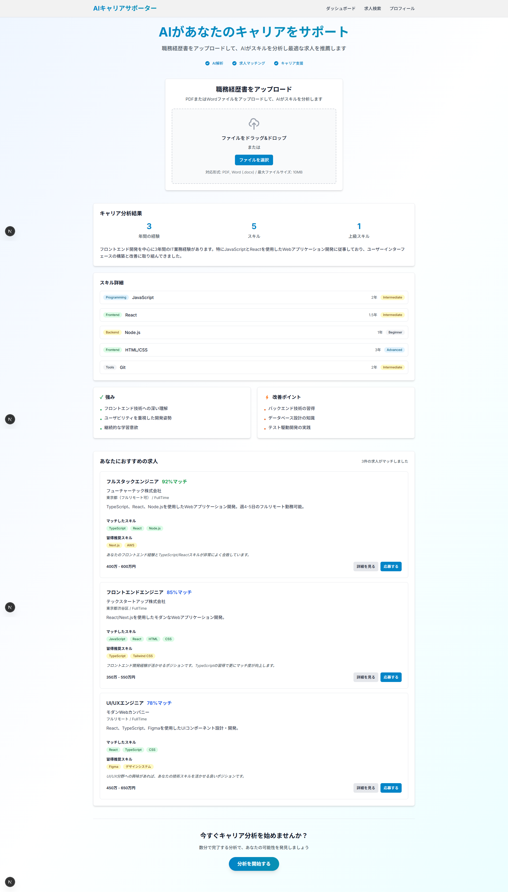

#  Portfolio_2

[](https://nextjs.org/)
[](https://www.typescriptlang.org/)
[](https://www.framer.com/motion/)
[](https://tailwindcss.com/)

初めまして。中畑 倫 (Rin Nakahata)と申します。
ご覧いただきありがとうございます。

---

## 本ポートフォリオの評価ポイント

 ### **このポートフォリオで最も重要視していただきたいのは、システム設計スキルとドキュメント作成力です。**

### **主要評価対象**
1. **[要件定義書](./docs/Requirements%20Definition.md)** - 要件整理・プロジェクト設計力の実証
2. **[技術改善提案書](./docs/Technical_Proposal.md)** - システム設計・アーキテクチャ設計力の実証

### **技術実装について**
Next.jsアプリケーションは**技術改善提案を実証するためのMVP実装**です。  
実際の評価対象は、このMVPをエンタープライズレベルに発展させる改善提案書にあります。


---

## 主要機能

>未経験からITエンジニアを目指すユーザーをターゲットとし、職務経歴書（PDF/Word）をアップロードするだけで、AIがスキルや経験を自動で解析・可視化する。さらに、その解析結果を基に、ユーザーに最適な求人情報を意味的な類似度でマッチングし、推薦するWebアプリケーション。

### 実際のWebページ画面


### **フロントエンド**
- **Next.js 15** - App Router, SSR, 最新機能
- **TypeScript** - 100% 型安全実装
- **Framer Motion** - 滑らかなアニメーション・マイクロインタラクション
- **Tailwind CSS** - レスポンシブ・モダンデザイン
- **コンポーネント設計** - 再利用可能なUIライブラリ

### **アプリケーション機能**
- **ファイルアップロード** - ドラッグ&ドロップ、形式検証、プログレス表示
- **AIキャリア分析** - ダミーデータでの分析結果可視化
- **求人推薦システム** - マッチングスコア、詳細モーダル
- **レスポンシブUI** - モバイル・タブレット・デスクトップ対応

### **アニメーション・UX**
- ページ遷移時のフェードイン効果
- ホバー・クリック時のマイクロインタラクション
- ローディング状態の視覚的フィードバック
- スティッキーヘッダー・スムーススクロール

---

## システムアーキテクチャ

### **フロントエンド**
- **アトミックデザイン** - 再利用可能コンポーネント
- **型安全性** - TypeScriptによる開発時エラー防止
- **パフォーマンス** - React.memo・useMemo・useCallback活用
- **アクセシビリティ** - WAI-ARIA準拠・キーボード操作対応

---

## プロジェクト構造

```
📁Portfolio_2/
├── 📁docs/                      # ドキュメント類（メイン成果物）
│   ├── TECHNICAL_PROPOSAL.md  # 技術改善提案書（50ページ相当）
│   └── CLAUDE.md              # ポートフォリオ要件定義書
├── 📁src/
│   ├── app/                   # Next.js App Router
│   ├── 📁components/            # 共通UIコンポーネント
│   │   ├── Button.tsx         # Framer Motion対応ボタン
│   │   ├── Card.tsx           # アニメーション付きカード
│   │   └── Modal.tsx          # 汎用モーダル
│   ├── 📁features/              # 機能別モジュール
│   │   ├── 📁fileUpload/        # ファイルアップロード機能
│   │   ├── 📁summaryDashboard/  # キャリア分析ダッシュボード
│   │   └── 📁jobRecommendation/ # 求人推薦システム
│   └── 📁types/                 # TypeScript型定義
│       ├── index.ts           # コア型定義
│       └── jobData.ts         # ダミー求人データ
└── README.md                  # このファイル
```

---

## クイックスタート

```bash
# リポジトリのクローン
git clone [repository-url]
cd Portfolio_2

# 依存関係のインストール
npm install

# 開発サーバー起動
npm run dev
# → http://localhost:3000 でアプリケーション確認

# 型チェック実行
npm run typecheck
```

---

## 開発環境セットアップ

```bash
# 開発環境
npm run dev          # 開発サーバー起動
npm run build        # 本番ビルド
npm run start        # 本番サーバー起動

# コード品質
npm run lint         # ESLint実行
npm run typecheck    # TypeScript型チェック

# パフォーマンス分析
npm run analyze      # Bundle分析（今後追加予定）
```

---

## 技術改善提案（詳細は企画書参照）

### **フェーズ1: API統合・高度化**
```typescript
// OpenAI API統合例
interface AIAnalysisService {
  analyzeResume(fileContent: string): Promise<CareerAnalysis>;
  generateEmbeddings(text: string): Promise<number[]>;
  matchJobs(userProfile: UserProfile, jobs: JobPosting[]): Promise<JobMatch[]>;
}
```

### **フェーズ2: 認証・セキュリティ強化**
```typescript
// Auth0統合・OWASP準拠セキュリティ
@UseGuards(JwtAuthGuard, RolesGuard)
@Roles('user', 'admin') 
async getSensitiveData(@User() user: AuthUser) { ... }
```

### **フェーズ3: データ基盤・スケーラビリティ**
```sql
-- PostgreSQL + pgvector によるベクトル検索
CREATE INDEX idx_career_analyses_embedding ON career_analyses 
USING ivfflat (embedding vector_cosine_ops);
```

### **フェーズ4: 本格運用・監視体制**
```yaml
# AWS Fargate + RDS + ElastiCache 構成
# CI/CD, 監視・アラート, パフォーマンス最適化
```

---

## 今後の展開・ロードマップ

### **短期（3ヶ月）**
- OpenAI API統合・リアルタイム解析
- Auth0認証・ユーザー管理
- PostgreSQL・データ永続化

### **中期（6ヶ月）**
- ベクトル検索・マッチング精度向上
- AWS Fargate・本格運用環境
- A/Bテスト・データ分析基盤

### **長期（12ヶ月）**
- マイクロサービス化・組織スケール対応
- 機械学習・独自AI機能開発
- エンタープライズ・B2B市場参入

---

##  ライセンス

このプロジェクトはMITライセンスの下で公開されています。

---

##  作者

**中畑 倫 (Rin Nakahata)**

---
